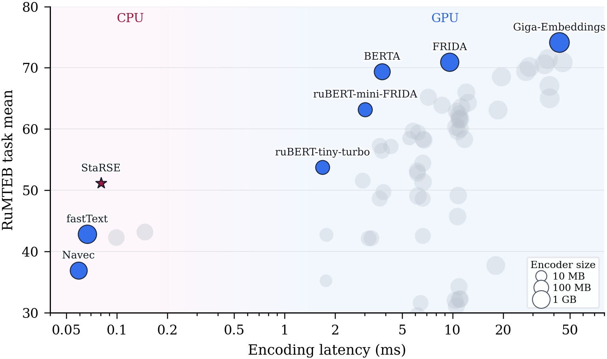

# StaRSE

**StaRSE** (**Sta**tic **R**ussian **S**entence **E**mbeddings) is a compact
Russian sentence encoder built from a static token table. The released model is
available at [BorisTM/starse](https://huggingface.co/BorisTM/starse) and works
through the Sentence Transformers API.

StaRSE has a 120,138-token vocabulary and 512-dimensional embeddings. Its
published package occupies 11.3 MiB and reaches a mean score of **51.16** over
the 23 tasks in `MTEB(rus, v1.1)`.



Static encoders in the figure use mean batch-1 CPU latency; contextual encoders
use mean batch-1 GPU latency. Static footprints are measured packages;
contextual footprints are estimated as parameter count times two bytes.

## Use the model

```bash
pip install -U sentence-transformers
```

```python
from sentence_transformers import SentenceTransformer

model = SentenceTransformer("BorisTM/starse", trust_remote_code=True)

sentences = [
    "Партитуры Чайковского часто звучат в консерватории.",
    "Балетная сцена хранит музыку Щелкунчика.",
    "Футбольная команда выиграла матч.",
]

embeddings = model.encode(sentences, normalize_embeddings=True)
similarities = model.similarity(embeddings, embeddings)

print(embeddings.shape)           # (3, 512)
print(tuple(similarities.shape))  # (3, 3)
print(similarities)
```

## Results

| Task type | Tasks | Mean score |
|---|---:|---:|
| Classification | 9 | 56.81 |
| Clustering | 3 | 51.80 |
| Multilabel classification | 2 | 35.01 |
| Pair classification | 1 | 52.50 |
| Reranking | 2 | 41.88 |
| Retrieval | 3 | 39.09 |
| STS | 3 | 62.17 |
| **All tasks** | **23** | **51.16** |

## Train StaRSE

The repository contains the Russian training pipeline used for the paper:

1. initialize a 512-dimensional static table from ruBERT-base input embeddings
   with token-level PCA, ABTT, and SIF-Zipf weighting;
2. run source-balanced symmetric contrastive training;
3. optimize the sign-projected table and export the resulting static model.

Python 3.11 is required. Install the pinned training environment with:

```bash
python3.11 -m venv .venv
source .venv/bin/activate
python -m pip install --upgrade pip
python -m pip install -e .
```

Training data is not included. Prepare Parquet files with two string columns,
`anchor` and `positive`, using this layout:

```text
DATA_ROOT/
├── cultura_ru/*.parquet
├── mmarco_ru/*.parquet
├── ru_hnp/*.parquet
└── ru_paraphrase_nmt_leipzig/*.parquet
```

Run the complete recipe:

```bash
export DATA_ROOT=/path/to/starse-data
export CUDA_VISIBLE_DEVICES=0
./scripts/train_starse_512.sh
```

The launcher writes the portable sign-projected Sentence Transformers model to
`outputs/starse`. Exact hyperparameters and source limits are stored in
[`configs/contrastive.yaml`](configs/contrastive.yaml) and
[`configs/sign-projected.yaml`](configs/sign-projected.yaml). To make a short
smoke run or reduce the batch size, invoke a stage directly:

```bash
starse-train \
  --config configs/contrastive.yaml \
  --data-root "$DATA_ROOT" \
  --model outputs/initialization \
  --output-dir outputs/smoke-test \
  --max-steps 10 \
  --batch-size 64 \
  --no-bf16
```

The compact packed inference checkpoint is distributed separately on
[Hugging Face](https://huggingface.co/BorisTM/starse).

## Citation

```bibtex
@misc{malashenko2026starse,
  title  = {StaRSE: Compact Russian Sentence Embeddings with a Sign-Coded Static Encoder},
  author = {Malashenko, Boris and Jarsky, Ivan and Soldatov, Egor and
            Luzhnov, Vladislav and Stumpf, Sviatoslav and Shmatkov, Vladislav and
            Shalamov, Viacheslav and Stankevich, Andrey and Efimova, Valeria},
  year   = {2026},
  url    = {https://github.com/BlessedTatonka/StarSE}
}
```

## License

Apache-2.0.
